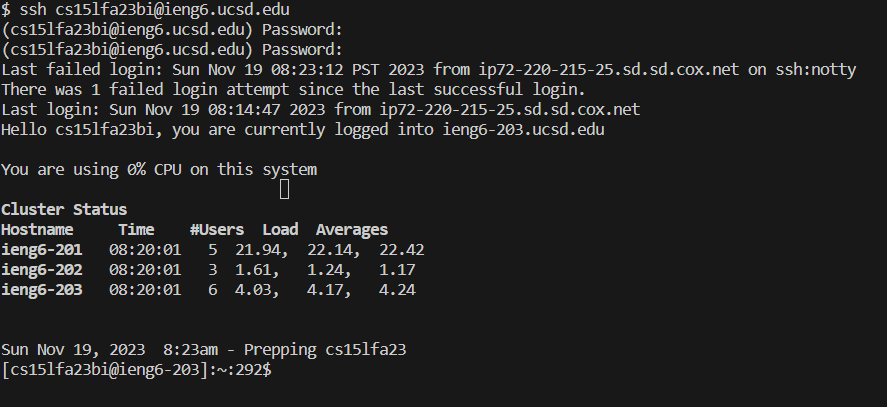
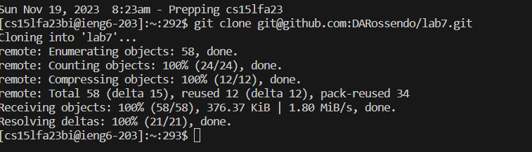
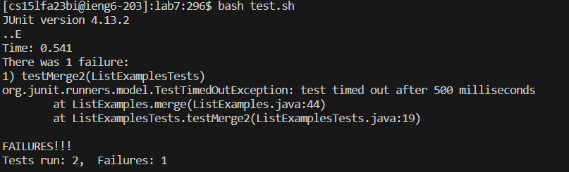
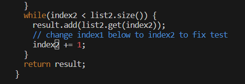
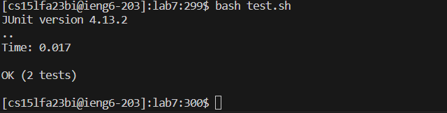
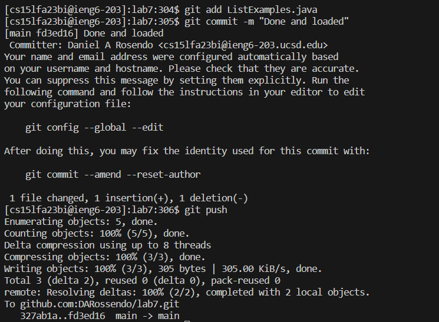

# Lab 7


## Step 4 

```
<control> + <C>: ssh cs15lfa23bi@ieng6.ucsd.edu, press <Enter> key, <control> + <v> into the terminal press <Enter> key
```
Basically, I logged into my ieg6 account.


## Step 5

```
<control> + <c>: git@github.com:DARossendo/lab7.git, press <Enter> key,  <control> + <v> into the terminal and press <Enter> key
```
Downloads and clones the information from the fork from the SSH clone.


## Step 6

```
`ls` into the terminal, see the directory, `cd` into `lab7/`, and `ls` again to see if I had all the appropriate files, into the terminal I typed `bash test.sh`
```
Checked for appropriate files and ran the tests as stated.


## Step 7

```
`ls` to check any additional changes made, type `vim ListExamples.java`, after I enter vim mode, and from the beginning of the code I press the `<down> key` 43 times, from there I press the `<right> key` 12 times, the pressing the `i key` once, then I press the `<backspace> key` once, then I press the `2 key` once, pressed the `ESC key` once, then typed `<:wq>` then press the `<Enter> key` once.  
```
The steps necessary to change the java file: entering vim, scrolling where the issue was, entering `insert` mode, changing the bug code to the correct one, saving the file, and finally exiting out of vim mode.


## Step 8

```
From the terminal type `bash test.sh`
```
Re-runs the tests after the corrected code.


## Step 9

```
Type `git add ListExamples.java`, press <Enter> key, then type `git commit -m "Done and loaded"`, press <Enter> key (In this case this is my message). then finally typed  `git push` and press <Enter> key 
```
Commit and push the saved file into GitHub.
