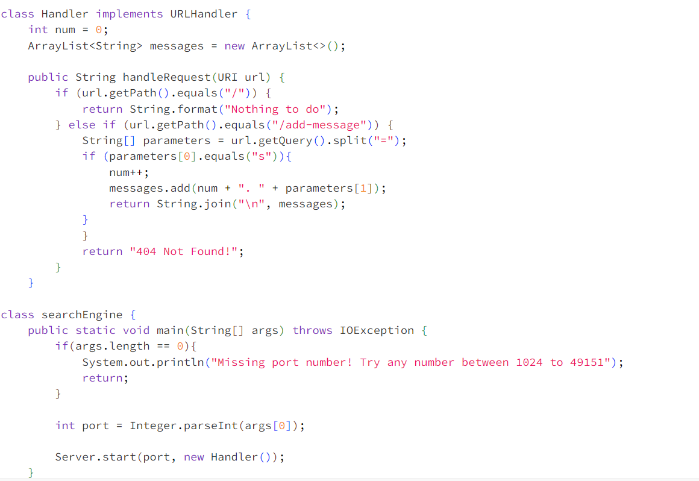
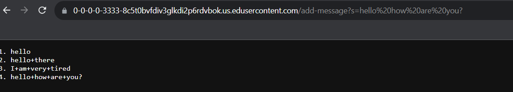
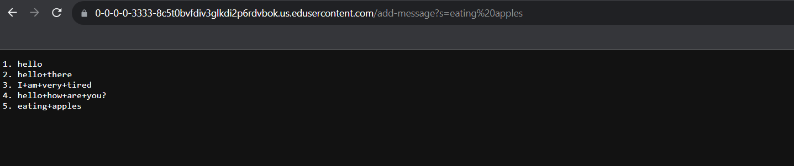
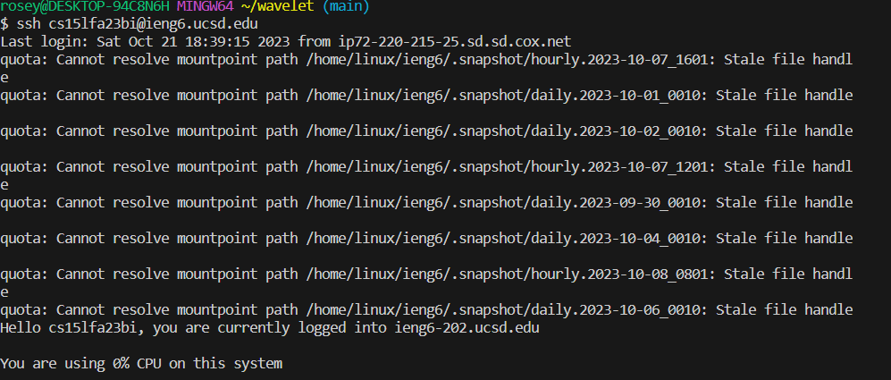

# Part 1

This is the general look of my code. It contains import *java.io.IOException;*, *import java.net.URI;* ,*import java.util.ArrayList;*, but it's not present
int the code.

> For this first screenshot, the method called is *HandleRequest* of a class called Handler, and *public static void main(String[] args) throws >IOException* from the class *ServerString*. For this piece of code, the relevant arguments are *ArrayList<String> messages = new ArrayList<>();* which >create an array and add *messages* as I keep adding, *URI* adds an object called
>*url* which represents the request that is being given by a user. Relevant values of those methods, in *HandleRequest* are *url.getPath().equals("/")* and
> >*url.getQuery().split("=");*, *url.getPath().equals("/add-message")* and *(parameters[0].equals("s"))*. These take in code that would process
> it to the server.
> I believe the values that changed were *ArrayList<String> messages = new ArrayList<>();* which would continuously add phrases every time the URL is changed, and *int >num* which increases the value as the number of phrases is added.

>For this second screenshot, consists of the same methods which are *HandleRequest* and *public static void main(String[] args) throws >IOException* which are >called from their specific classes. The relevant arguments are  still the same *ArrayList<String> messages = new ArrayList<>();* and *URI*. as well as the same
> values such as *url.getPath().equals("/")* and *url.getQuery().split("=");*, *url.getPath().equals("/add-message")* and *(parameters[0].equals("s"))*.
> The same proper values are called *ArrayList<String> messages = new ArrayList<>();* and *int >num*. are called.

# Part 2

