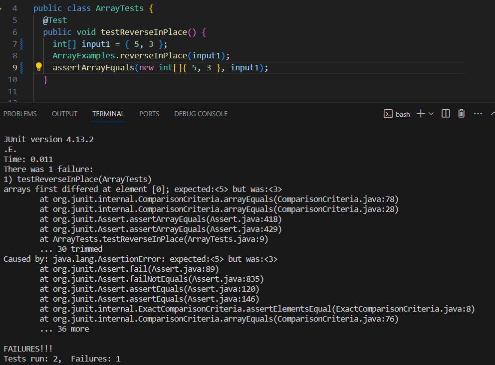
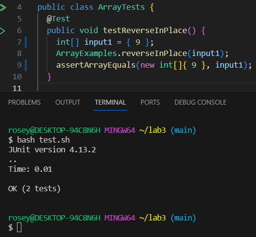

# Part 1
---
This is from the `ArrayExamples.java` java file and under the method `static void reverseInPlace(int[] arr)`

**A failure-inducing input**

```
@Test 
public void testReverseInPlace() {
    int[] input1 = { 3, 5 };
    ArrayExamples.reverseInPlace(input1);
    assertArrayEquals(new int[]{ 5, 3 }, input1);
}
```

**An input that doesn’t induce a failure**
```
@Test 
public void testReverseInPlace() {
    int[] input1 = { 9 };
    ArrayExamples.reverseInPlace(input1);
    assertArrayEquals(new int[]{ 9 }, input1);
}
```

**The symptom**





**The bug**

Before:
```
static void reverseInPlace(int[] arr) {
    for(int i = 0; i < arr.length; i += 1) {
      arr[i] = arr[arr.length - i - 1];
    }
}
```


After:
```
static void reverseInPlace(int[] arr) {
    for(int i = 0; i < (arr.length / 2); i += 1) {
      int placeHolder = arr[i];
      arr[i] = arr[arr.length - i - 1];
      arr[arr.length - i - 1] = placeHolder;
    }
}

```
For this piece of code, I added the `(arr.length / 2)` and `int placeHolder = arr[i];` as well as `arr[arr.length - i - 1] = placeHolder;`. `(arr.length / 2)` is to ensure that the iterated value falls properly in its place; continuing to iterate the value would just take you to the original input from `@Test`. Creating a holding variable such that it holds or takes into memory the array and storing that information in that same array. 


# Part 2: `find` command
---


