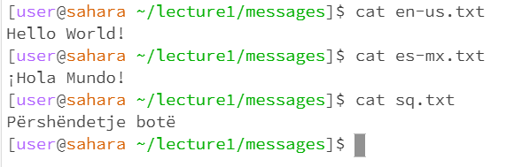
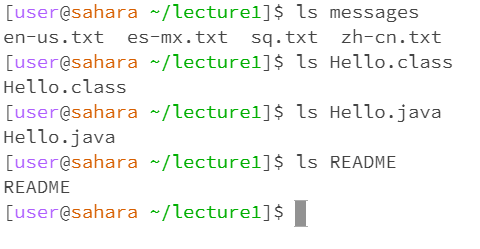
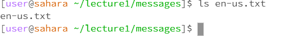
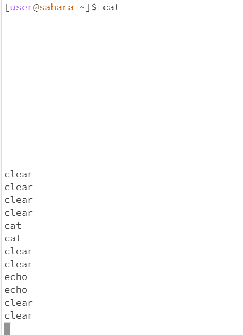
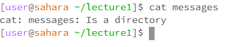

---

# CD
---

**-cd (no argument)**

...
- The working directory is /home/lecturee1. Without argument, *cd* changed my working directory from /home/lecture1 to /home. This is not an error, as it doesn't consist of an error message, and *cd* behaves that of /home, your starting working directory.
...

**-cd (directory argument)**

...
- The working directory is /home/lecture1/messages. With an argument, specifically to a working directory, it changes to another directory that exists within the working directory. However, when I tried to *cd* to a text file it gave me an error as it was *not a directory*.
...

**-cd (file argument)**

...
- The working directories were /home/lecture1/messages. When I cd to a file within the *lecture 1* directory, I received an error stating that such a directory did not exist. The output that I received was an error on my part as it demonstrated that the file was not a directory and that I was in the incorrect directory to begin
with.
...

#ls
---

**-ls (no argument)**

...
- The working directories /home and within it was just lecture1, bolded in blue. When I ls without an argument, it displays my current directory. For example when I was at /home/ it displayed *lecture 1* and when I cd into the directory and then *ls* I got the content in the directory. This shows no errors and does not provide any errors.
...

**-ls (directory argument)**

...
- The working directory was /home/lecture1. For this if I *ls* to a specific directory it will give the content of that directory for as long that I am present where the current directory is. For example, if I am in /home and try to *-ls messages* it would give me an error due to not being where the file is located. I was able to *ls* from /home/lecture1 with ease into other directories and get its content just fine with no errors.
...

**-ls (file argument)**

...
- The working directory was /home/lecture1/messages. For this, I *ls* a random file within /home, however, it would return an error such that such file does not exist. However when I cd to /lecture1/messages and *ls* into a file, it returns the file name, rather than its content. I believe this is not an error as I believe *ls* gives information of descriptors of directory/file.
...

#cat
---

**-cat (no argument)**

...
- Working directories was /home/. Without an argument, *cat* simply seems to double anything that was typed and entered. For example, when I typed cleared the system simply repeated the same values. I believe this is not an error as it might be used to test code however in order to get out of this repeating behavior I had to to hold and press *ctrl + c*; this command ends the code.
...

**-cat (directory argument)**

...
- Working directories were /home/lecture1. With a directory argument, it simply prints out the name of the directory and states that is a directory. This is not an error as it doesn't seem to send any code command error.
...

**-cat (file argument)**

...
- Working directories /home/lecture1/messages. When I *cat* to a file, it simply prints out the contents in a file. Such as when *cat* to specific text files within messages it displays its content. This is not an error from what I gathered.
...
